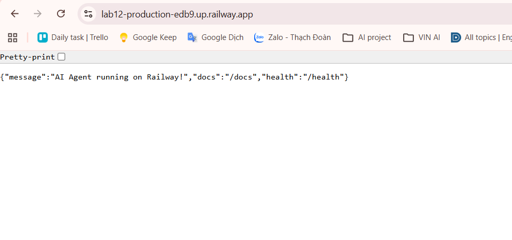

# Day 12 Lab - Mission Answers

## Part 1: Localhost vs Production

### Exercise 1.1: Anti-patterns found
1. **Hardcode API Key**: Mật khẩu và API key (như `OPENAI_API_KEY`) bị ghi trực tiếp vào mã nguồn, gây rủi ro lộ lọt bảo mật cực lớn khi đẩy code lên GitHub.
2. **Hardcode Port và Host**: Ứng dụng bị gắn cứng vào `localhost` và port `8000`, khiến nó không thể chạy được trong container hoặc trên cloud (cloud thường tự cấp phát port ngẫu nhiên).
3. **Thiếu Health Check**: Không có các endpoint như `/health` hay `/ready` để hệ thống quản lý (như Docker/Kubernetes/Railway) biết trạng thái sống còn của ứng dụng.
4. **Sử dụng Print thay vì Logging chuẩn**: In log bằng `print()` không thể theo dõi phân tích tự động trên các hệ thống giám sát lớn, và code cũ thậm chí in lộ luôn cả secret key ra màn hình.
5. **Thiếu Graceful Shutdown**: Ứng dụng bị tắt đột ngột khiến các request đang xử lý bị ngắt ngang lập tức, sinh ra lỗi 502/503 cho client.

### Exercise 1.3: Comparison table
| Feature | Develop (Basic) | Production (Advanced) | Tại sao quan trọng? |
|---------|---------|------------|----------------|
| **Config**  | Hardcode trực tiếp các biến số và secret. | Dùng Environment variables. | Tránh lộ dữ liệu nhạy cảm trên GitHub. Dễ đổi thông số cho từng môi trường. |
| **Health check** | ❌ Không có | ✅ Có (`/health`, `/ready`) | Nền tảng Cloud cần endpoint này để liên tục hỏi thăm server, tự động restart nếu bị treo. |
| **Logging** | Dùng `print()` đơn giản. | Structured JSON Logging. | Giúp hệ thống log chuyên nghiệp dễ bóc tách, lọc, và tìm kiếm tự động. |
| **Shutdown** | Đột ngột | Graceful shutdown | Cho phép app hoàn thành nốt request đang chạy dở trước khi tắt hẳn, tránh rớt kết nối. |
| **Network** | Bind `localhost` và port cố định | Bind `0.0.0.0` và Port linh hoạt | Bắt buộc để nhận traffic khi chạy trong Docker container và triển khai lên Cloud. |

## Part 2: Docker

### Exercise 2.1: Dockerfile questions
1. **Base image**: `python:3.11` (Bản phân phối hệ điều hành và Python đầy đủ).
2. **Working directory**: `/app` (Thư mục làm việc mặc định mọi câu lệnh sẽ thực thi trong container).
3. **Tại sao COPY requirements.txt trước?**: Để tận dụng cơ chế Docker Layer Cache. Giúp quá trình build lại (rebuild) cực kỳ nhanh khi code thay đổi nhưng thư viện thì không đổi.
4. **CMD vs ENTRYPOINT**: `CMD` dễ dàng bị ghi đè (override) khi truyền lệnh khác vào cuối dòng `docker run`, còn `ENTRYPOINT` thì khóa cứng ứng dụng sẽ chạy và chỉ nhận lệnh thêm vào dạng tham số (arguments).

### Exercise 2.3: Image size comparison
- Develop: 1.66 GB
- Production (Advanced): 236 MB
- Difference: Giảm khoảng ~85.8% (Nguyên nhân do sử dụng kiến trúc Multi-stage build, loại bỏ hoàn toàn các build tools nặng nề như gcc và các file cache rác ở stage 2).

## Part 3: Cloud Deployment

### Exercise 3.1: Railway deployment
- URL: https://lab12-production-edb9.up.railway.app
- Screenshot: 

### Exercise 3.2: So sánh render.yaml và railway.toml
| Tiêu chí | `render.yaml` | `railway.toml` |
|---------|---------------|----------------|
| **Mức độ chi tiết** | Cao. Khai báo rõ loại service (web, worker), cấu hình phần cứng (plan), vị trí server (region). | Thấp. Tập trung vào cách build và chạy app. |
| **Quản lý biến môi trường** | Có thể khai báo sẵn các biến môi trường trực tiếp trong file (`envVars`). Hỗ trợ tạo tự động (`generateValue`). | Thường không định nghĩa biến môi trường trong file này, mà phải set qua CLI hoặc giao diện web. |
| **Quá trình Build** | Phải định nghĩa rõ lệnh build (`buildCommand`) ví dụ `pip install...`. | Dùng Nixpacks tự động nhận diện ngôn ngữ và tự tìm cách build, hoặc tự nhận diện `Dockerfile`. |
| **Mục đích thiết kế** | Là "Infrastructure as Code" thực thụ, có thể dựng toàn bộ hạ tầng phức tạp (DB, Redis, Web) qua 1 file. | Đơn giản, gọn nhẹ, chủ yếu để tinh chỉnh cấu hình triển khai cơ bản. |

## Part 4: API Security

### Exercise 4.1: API Key Authentication
**A. Trả lời câu hỏi:**
1. **API key được check ở đâu?** 
   - Nó được check bên trong hàm `verify_api_key()`. Hàm này được gắn vào endpoint bảo mật bằng Dependency Injection của FastAPI qua cú pháp `Depends(verify_api_key)`.
2. **Điều gì xảy ra nếu sai key?** 
   - Hệ thống sẽ chặn request và báo lỗi HTTP `403 Forbidden` (kèm dòng chữ "Invalid API key."). Còn nếu không truyền header `X-API-Key` thì báo lỗi `401 Unauthorized`.
3. **Làm sao rotate key?** 
   - Do key được đọc từ `os.getenv("AGENT_API_KEY")`, ta chỉ cần đổi giá trị biến môi trường này (qua Railway Dashboard hoặc file `.env.local`) rồi Restart lại ứng dụng. Code không cần sửa một dòng nào.

**B. Test results:**
*Trường hợp 1: Không có key hợp lệ (hoặc thiếu key)*
```json
{"detail":"Missing API key. Include header: X-API-Key: <your-key>"}
```

*Trường hợp 2: Có key hợp lệ*
```json
{"question":"Hello","answer":"Agent đang hoạt động tốt! (mock response) Hỏi thêm câu hỏi đi nhé."}
```

### Exercise 4.2: JWT Authentication (Advanced)
**A. Hiểu JWT Flow (Từ auth.py):**
- **Lấy Token:** Người dùng gọi `POST /auth/token` với `username` và `password`. Nếu đúng, server tạo JWT Token chứa thông tin user và hạn sử dụng (60 phút), được ký bảo mật bằng `SECRET_KEY`.
- **Sử dụng Token:** Người dùng gọi endpoint bảo mật `/ask` và đính kèm token vào header `Authorization: Bearer <token>`.
- **Xác thực:** Server dùng `verify_token()` để giải mã và kiểm tra chữ ký. Nếu hợp lệ, lấy ra được thông tin user để xử lý request mà không cần truy vấn database liên tục.

**B. Test results (Gọi API bằng Token hợp lệ):**
```json
{"question":"Explain JWT","answer":"Đây là câu trả lời từ AI agent (mock). Trong production, kết nối với OpenAI/Anthropic.","usage":{"requests_remaining":9,"budget_remaining_usd":2.1e-05}}
```

### Exercise 4.3: Rate Limiting
**A. Trả lời câu hỏi:**
1. **Algorithm nào được dùng?** 
   - Thuật toán `Sliding Window Counter` (Cửa sổ trượt thời gian, tự động loại bỏ các request đã quá 60 giây khỏi bộ đếm).
2. **Limit là bao nhiêu requests/minute?**
   - Đối với tài khoản bình thường (user): 10 requests / 60 giây.
   - Đối với tài khoản quản trị (admin): 100 requests / 60 giây.
3. **Làm sao bypass limit cho admin?**
   - Không cần bypass thủ công, hệ thống tự giải mã `role` từ trong JWT Token. Nếu `role == "admin"`, hệ thống tự động chuyển sang dùng bộ đếm riêng biệt (`rate_limiter_admin`) có giới hạn cao gấp 10 lần.

**B. Test results:**
Vòng lặp 10 request đầu tiên thành công:
```json
{"question":"Test 9","answer":"Đây là câu trả lời từ AI agent (mock)...","usage":{"requests_remaining":1,"budget_remaining_usd":0.000196}}
{"question":"Test 10","answer":"Tôi là AI agent được deploy lên cloud...","usage":{"requests_remaining":0,"budget_remaining_usd":0.000214}}
```

Từ request thứ 11 trở đi, hệ thống chặn lại và báo lỗi Rate Limit:
```json
{"detail":{"error":"Rate limit exceeded","limit":10,"window_seconds":60,"retry_after_seconds":56}}
{"detail":{"error":"Rate limit exceeded","limit":10,"window_seconds":60,"retry_after_seconds":56}}
```

### Exercise 4.4: Cost guard implementation
**A. Cách hoạt động hiện tại (Trong file `cost_guard.py`):**
Hệ thống hiện dùng bộ nhớ RAM (In-memory Dictionary) lưu trữ `UsageRecord` để theo dõi số token sử dụng mỗi ngày của từng user. Mỗi khi có request, hàm `check_budget()` kiểm tra tổng chi phí hiện tại. Nếu vượt quá `$1/ngày` cho cá nhân hoặc `$10/ngày` cho toàn cầu, hệ thống sẽ chặn và trả về mã lỗi `402 Payment Required` hoặc `503`. Cách này chạy tốt nhưng nếu Server bị khởi động lại thì dữ liệu sẽ mất.

**B. Giải pháp chuẩn Production (Dùng Redis theo yêu cầu đề bài):**
Để các server đồng bộ với nhau và không bị mất dữ liệu, ta lưu chi phí vào Redis. Mỗi User có 1 key ghi nhận số USD đã tiêu trong tháng đó. Khi qua tháng mới, key tự động biến mất nhờ tính năng TTL (Time To Live).

```python
import redis
import time

# Kết nối tới Redis
r = redis.Redis(host='localhost', port=6379, db=0)

def check_budget(user_id: str, estimated_cost: float) -> bool:
    """
    Return True nếu còn budget, False nếu vượt ($10/tháng).
    """
    # Tạo key theo tháng (Ví dụ: budget:student:2026-06)
    month_key = time.strftime("%Y-%m")
    redis_key = f"budget:{user_id}:{month_key}"
    
    # Cộng dồn chi phí vào key
    current_spent = r.incrbyfloat(redis_key, estimated_cost)
    
    # Nếu là request đầu tiên của tháng, cài đặt tự động reset sau 31 ngày
    if current_spent == estimated_cost:
        r.expire(redis_key, 31 * 24 * 60 * 60)
        
    # So sánh với ngân sách $10
    if current_spent > 10.0:
        return False # Đã hết tiền
        
    return True # Vẫn còn tiền
```
## Part 5: Scaling & Reliability

### Exercise 5.1-5.5: Implementation notes
**1. Health Checks (Liveness & Readiness):**
- **Liveness (`/health`)**: Trả về trạng thái "ok" kèm thông tin uptime, version và mức sử dụng RAM. Dùng để hệ thống quản lý (Kubernetes/Docker) biết container còn sống không (nếu treo thì nó tự động restart).
- **Readiness (`/ready`)**: Kiểm tra cờ `_is_ready` và trạng thái kết nối tới Database/Redis. Nếu sẵn sàng nhận traffic mới trả về 200, ngược lại trả về 503 để Load Balancer (như Nginx) tạm thời không đẩy traffic vào.

**2. Graceful Shutdown:**
- Hệ thống lắng nghe tín hiệu tắt từ hệ điều hành qua đoạn code `signal.signal(signal.SIGTERM, handle_sigterm)`.
- Khi nhận lệnh tắt, app sẽ chặn nhận request mới, sau đó kiên nhẫn chờ tối đa 30 giây để hoàn thành nốt các request đang xử lý dở (`_in_flight_requests`), rồi mới chính thức thoát. Việc này giúp user không bao giờ bị rớt kết nối đột ngột.

**3. Stateless Design & Load Balancing:**
- **Vấn đề Anti-pattern**: Nếu lưu trạng thái (như lịch sử chat) vào bộ nhớ RAM của Python, khi ta nhân bản (scale) lên 3 Server, user đang chat với Server A chuyển sang Server B sẽ bị mất trí nhớ hoàn toàn.
- **Giải pháp Stateless**: Chuyển toàn bộ việc lưu trữ phiên chat (Session History) vào **Redis**. Nhờ vậy, bộ nhớ RAM của ứng dụng được giải phóng hoàn toàn (Stateless - Không trạng thái).
- **Hiệu quả**: Khi kết hợp với **Nginx Load Balancer**, các request của user được phân bổ đều đặn (Round-robin) cho 3 Server xử lý, giúp tăng tốc độ. Đồng thời vì cả 3 Server đều cắm chung vào 1 Redis, dù request bay vào Server nào thì con AI vẫn nhớ toàn bộ ngữ cảnh cuộc trò chuyện!
